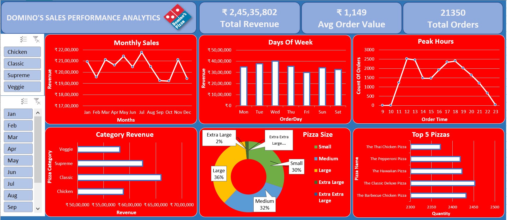

# 🍕 Domino’s Sales Performance Dashboard – Excel Data Analytics Project

### 📊 Real-World Business Analytics Using Microsoft Excel

This project analyzes one year of Domino’s pizza sales data and transforms it into a **dynamic, interactive Excel Dashboard** that uncovers actionable business insights.  
It demonstrates how Excel can be used as a full-fledged **Business Intelligence (BI) tool** through data cleaning, transformation, and visualization.

---

## 🚀 Project Overview

**Objective:**  
To analyze Domino’s sales data and identify performance trends, customer behavior, and product insights — turning raw transactional data into meaningful intelligence.

**Key Goals:**
- Measure total revenue and average order value (AOV)
- Track monthly and daily sales trends
- Identify best-selling pizzas and popular categories
- Determine peak order times and high-performing days
- Provide strategic business recommendations

---

## 🧩 Tech Stack & Tools Used

| Tool / Technology | Purpose |
|--------------------|----------|
| **Microsoft Excel** | Data cleaning, transformation, pivot modeling |
| **Pivot Tables & Charts** | Core analytics engine |
| **Slicers & Timelines** | Interactivity & filtering |
| **Conditional Formatting** | Data highlighting |
| **Data Validation & Feature Engineering** | Enhanced analysis readiness |

---

## ⚙️ Data Preparation

Key data fields engineered for this project:
- **Total Revenue** = `Price × Quantity`
- **Order Day / Hour** extracted from datetime
- **Pizza Category & Size** used for segmentation
- Removed nulls, standardized categories, formatted timestamps

---

## 📈 Dashboard Features

✅ KPI Cards for **Total Revenue**, **Average Order Value**, and **Total Orders**  
✅ Interactive **Monthly and Weekly Sales Trends**  
✅ Distribution of **Orders by Hour of Day**  
✅ **Top 5 Best-Selling Pizzas** by quantity  
✅ Category-wise revenue analysis  
✅ Dynamic **Slicers & Timelines** for filters  

---

## 💡 Key Business Insights

| Insight | Details |
|----------|----------|
| 💰 **Total Revenue** | ₹24,535,801 |
| 📦 **Most Ordered Size** | Large |
| 🍕 **Top Pizza Category** | Classic – ₹6.6M revenue |
| 🏆 **Top 5 Pizzas** | Classic Deluxe, BBQ Chicken, Hawaiian, Pepperoni, Veggie Paradise |
| 🕒 **Peak Hours** | 1 PM (Lunch) & 7 PM (Dinner) |
| 📅 **Best Day** | Wednesday |
| 📉 **Lowest Day** | Friday – ideal for promotions |

---

## 🧠 Strategic Recommendations

1️⃣ **Fix Friday Sales Drop:** Introduce weekend combo deals to lift low Friday performance.  
2️⃣ **Upsell to Increase AOV:** Encourage add-ons (drinks, sides) to raise AOV by 10%.  
3️⃣ **Optimize Operations:** Schedule staff & inventory for dinner rush (6–8 PM).  

---

## 📂 Dataset Information

- **Source:** Domino’s Sales Dataset (public practice dataset)  
- **Dataset Credit:** [Ayushi Jain](https://github.com/Ayushi0214/Masterclass-Datasets/tree/main/domino's)  
- **Format:** CSV (order details with timestamps, category, price, and quantity)

---

## 📸 Dashboard Preview

> 🖼️ Add a screenshot of your Excel Dashboard here once uploaded.  
> Example:  
> ```markdown
> 
> ```

---

## 🧩 Project Structure

